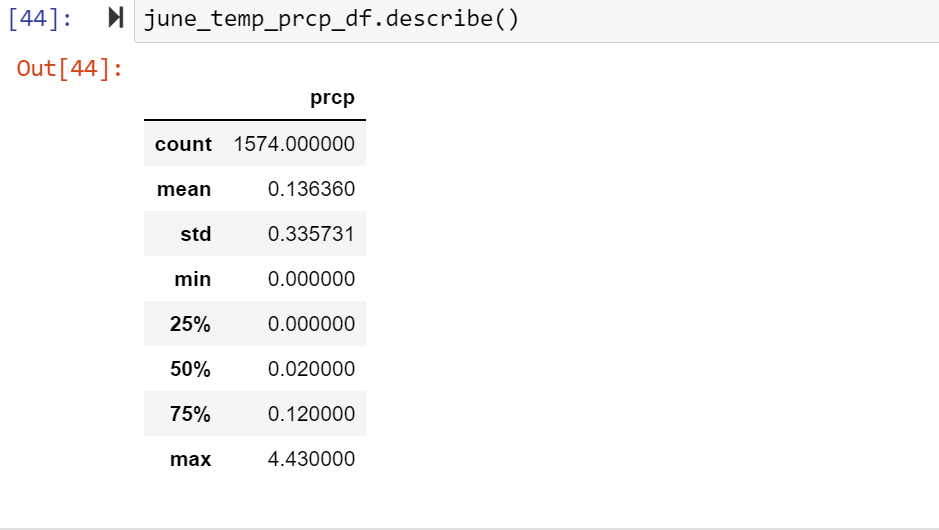
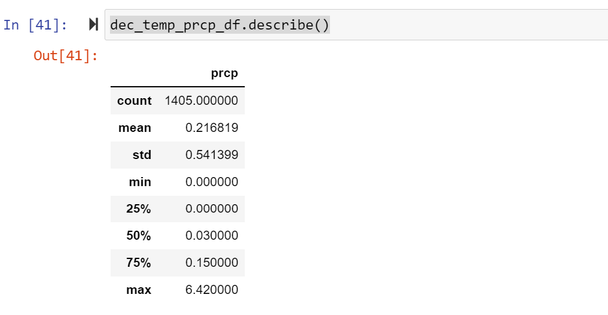

# surfs_up
### Overview of the statistical analysis:

* In this challange we have to found the temprature of Hwaii in month of June and December. from this data we can get an idea about the sale of Ice-Cream.
    As we perform the challange and got the result we get the data of temprature for perticular months.
### Results:

* The average temperatures are higher in June compared to December measurement.

* We can see the maximum temperature in the following images that 85 degree temprature was measured in June compared to a maximum temperature of 83 degree in December.

* The lowest minimum temperature is 56 degrees in .

### Summary:
* There are two extra june and december temprature calculation we can see in following Images

